# v0.1.0 DESIGN

TODO: update this consistent with all design versions.
---

## Table of Contents

- [v0.1.0 DESIGN](#v010-design)
  - [TODO: update this consistent with all design versions.](#todo-update-this-consistent-with-all-design-versions)
  - [Table of Contents](#table-of-contents)
  - [Introduction](#introduction)
  - [System Design Requirements](#system-design-requirements)
    - [Input](#input)
    - [Output](#output)
    - [User Specifications](#user-specifications)
  - [Hand Design](#hand-design)
    - [Switch Selection](#switch-selection)
    - [Input and Output Capacitor Selection](#input-and-output-capacitor-selection)
    - [Inductor Selection](#inductor-selection)
      - [Hand Designed Process](#hand-designed-process)
      - [Reverse Engineered Process](#reverse-engineered-process)
    - [Layout](#layout)
    - [Simulation Results](#simulation-results)
    - [Experimental Results](#experimental-results)
  - [Automated Design](#automated-design)
    - [Optimizer Design Output](#optimizer-design-output)
      - [Capacitor FOM](#capacitor-fom)
      - [Inductor Optimization](#inductor-optimization)
    - [Optimizer Simulation Output](#optimizer-simulation-output)
  - [Conclusion and Further Work](#conclusion-and-further-work)

---

## Introduction

This document outlines the design process and results of two comparable MPPT
designs; one that was developed by hand and validated experimentally; the other
generated by our optimization algorithm pipeline.

---

## System Design Requirements

---

### Input

We define the input of the MPPT to be a solar array, consisting of a large
number of photovoltaic cells strung in series with bypass diodes across each
cluster of cells. This solar array, in optimal conditions (STC = $25 \, C$,
$1000 \frac{W}{m^2}$), shall have the following characteristics.

| Property           | Value  | Units |
|--------------------|--------|-------|
| Cell Specific      |        |       |
| $V_{OC}$           | 0.721  | V     |
| $I_{SC}$           | 6.15   | A     |
| $V_{MPP}$          | 0.621  | V     |
| $I_{MPP}$          | 5.84   | A     |
| $P_{MPP}$          | 3.63   | W     |
| Array Specific     |        |       |
| $N_{CELLS}$        | 111    |       |
| $V_{OC}$           | 80.031 | V     |
| $I_{SC}$           | 6.15   | A     |
| $V_{MPP}$          | 68.931 | V     |
| $I_{MPP}$          | 5.84   | A     |
| $P_{MPP}$          | 402.56 | W     |

A specification of the cell characteristics and the model output used for this
design is shown below.


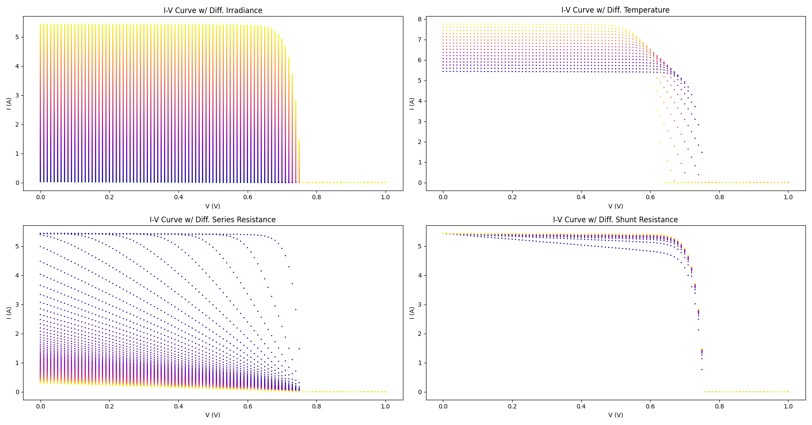

---

### Output

We define the output of the MPPT to be a LiMnNi battery pack, with a voltage
range of $V_{BATT} \in [80, 134.4] \, V$. We assume a maximum charging current
of $10 \, A$ at any charge voltage, for lack of a better model.

---

### User Specifications

Using the above input and output, we define the user specifications as follows:

```json
{
    "NAME": "Broad range MPPT",
    "AUTHORS": ["Matthew Yu", "Jacob Pustilnik"],
    "DESCRIPTION": "MPPT Boost Converter v0.1.0",
    "DATE_DESIGNED": "05/07/23",
    "DESIGN": {
        "input_source": {
            "source_model_type": "solar_cell",
            "cell_type": "Maxeon Gen III Bin Le1",
            "num_cells": 111,
            "r_sh": 40,
            "r_s": 0.0035,
            "inp_ripple (V)": 0.725,
            "user_v_range": [20.335, 74.481]
        },
        "output_sink": {
            "sink_model_type": "battery",
            "battery_type": "INR21700-M50LT",
            "num_cells": 32,
            "out_ripple (V)": 1.0,
            "user_v_range": [80, 130]
        },
        "safety_factor": 1.25
    }
}
```

We specify the shunt resistance and series resistance of the solar cell model as
based on empirical data with the I-V Curve Tracer testing setup.

We define the input voltage range to be $V_{ARR} \in [20.335, 74.481] \, V$
during the hand-design process to minimize switch stress and improve system
efficiency.

The input voltage peak-to-peak specification is slightly less than $1 \,\%$ of the
maximum input voltage ($74.481 \, V$).

The output voltage peak-to-peak specification is a conservative estimate of the
requirements of the LHR Solar BPS system. They did not give us a concrete number
(or any number, really), so we surmised that a $1 \, V_{pp}$ ripple should be
sufficient. This also means that for continuous transfer of energy in the
direction of the BPS, the output voltage of the system must be greater than the
voltage of the load plus the half of the ripple. A smaller ripple would allow us
to get closer to the load voltage and can marginally reduce switching stress.

The inductor current peak-to-peak specification is based on the typical $20\,\%$
current ripple ratio used in converters. It was increased to about $22.358\, \%$
due to the optimization process.

We use a safety factor of 1.25 to reduce system risk and improve operational
lifetime.

---

## Hand Design

The first version of this converter, version 0.1.0, was hand designed from
scratch. The following subsections discusses the methodology behind the design,
the expected and actual performance, and ultimately how it informs the automated
design process.

---

### Switch Selection

The main consideration for switch selection is the switching frequency relative
to the power loss; a better switch relative to another will have a higher
switching frequency for the same or less power consumption. Additionally, a
higher switching frequency has knock-on effects for passive selection; it
reduces the effective ripple experienced by the inductors and capacitors and
reduces their energy storage requirements.

One way to quantize switch performance is to use a Figure of Merit (FOM). The
established FOM for MOSFETs is $\tau = R_{DS,ON} * C_{OSS}$; a lower $\tau$
indicates a better switch.

We investigated a set of GaN switches, extracting $R_{DS,ON}$ values at $25 \,C$
and $125 \, C$ and $C_{OSS}$ values at $0 \, V$ and $150 \, V$. Taking the
average of these values, we established the FOM in $ps$.


To determine the optimal switch, we took the top 12.5 percentile FOM and mapped
the $R_{DS,ON}$ vs $F_{SW,MAX}$ for a given power budget for various operating
points.

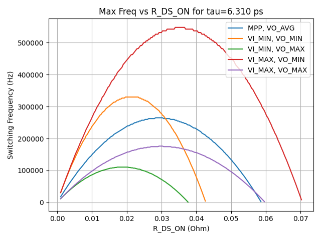

We see that the worst case plot is when the input voltage is minimized and the
output voltage is maximized. At an $R_{DS,ON}$ of about $19 \, m\Omega$. We
maximize the $F_{SW}$ at around $104 \, kHz$. It can be intuited that
an $R_{DS,ON}$ ratio to $C_{OSS}$ is slightly more important than the overall
FOM value.

As such, the ideal candidate for the design is the EPC2207, which has the
closest $R_{DS,ON}$ at the lowest FOM. This was not available at the time of
design, so the next closest candidate, the EPC2307 was chosen.

Rerunning the calculations of max lower bound $F_{SW}$ for a given power budget,
we achieved a switching frequency of $104 \, kHz$.


---

### Input and Output Capacitor Selection

The input and output capacitor selection depends on several parameters:

- the required capacitance needed to reduce ripple to below the design
specification at the worst case operating point,
- the ripple current that needs to be supported by the set of capacitors,
- and the loss due to ESR and leakage current.

The first and second parameters are the constraining function of the capacitor
selection, while the third parameter is the optimization function of the
capacitor selection.

Given the switching frequency of the device, we simulated the minimum
capacitance (and inductance) required to hit the target ripple across the I/O
mapping of the device.


We noted a minimum required input capacitance of $5.5 \, \mu F$ and output capacitance
of $15.2 \, \mu F$ in order to meet or beat our ripple target across the I/O mapping
of the device.

From this, we selected capacitors for bulk capacitance and hf capacitance.
The input capacitor consisted of a single aluminum organic polymer electrolytic
capacitor A759KS156M2AAAE52, with a capacitance of $15 \, \mu F$. The output capacitors
consisted of two aluminum organic polymer electrolytic capacitors
A759MS186M2CAAE90, with a capacitance of $18 \, \mu F$. These bulk capacitances are well
beyond the required capacitance and thus we predict that the expected ripple
will be tighter than required.

We also selected a hf switching node MLCC capacitor to reduce switching noise,
the CGA9P3X7T2E225MA, with a capacitance of $2.2 \, \mu F$. At $125 \, V$ DC bias and
$125 \, C$, the capacitance derating goes down to slightly above $1 \, \mu F$. At
about $100 \, kHz$, the ESR is about $5.5 \, m\Omega$.

---

### Inductor Selection

The inductor selection consists of two components; the inductor core geometry,
and the inductor core material. An ideal inductor is one that minimizes volume
and wire length while keeping losses low.

The minimum inductance calculated by the procedure above was $109.2 \, \mu H$.

It must be noted here that the hand-designed process for calculating the
inductance neglected core gap, which caused issues during the experimental
testing. Below we will present the results of the flawed calculation versus the
reverse engineered variant using the automated design system.

---

#### Hand Designed Process

With a target $110 \, \mu H$ inductance, the hand-designed process generated a
design using the EPCOS/TDK PQ26/25, 3C97 core, the B65877A0000R097. It required
35 turns with a wire gauge of 21 AWG.

This results in a estimated conduction loss of $4.5 \, W$ and core loss of
$0.2 \, W$.

---

#### Reverse Engineered Process

Using the same core, the algorithm determined that the inductor requires 31
turns of 19 AWG wire with a core gap of $1.0 \, mm$ per side of the core.

This results in an estimated conduction loss of $0.3 \, W$ and a core loss of
$0.03 \, W$.

As can be seen, the reverse engineered process results in a much lower
conduction and core loss. Part of the changes between the two designs is that it
was determined experimentally that the 0.3 winding factor used for calculating
the number of turns that can fit around the core was an overly-conservative
estimate, this has been increased to 0.5. In tern, this allows for fitting a
thicker gauge wire which can significantly reduce conduction loss, which appears
to be the main mode of inductor loss during experimental testing.

---

### Layout

This layout section discusses component placement in brief; it does not discuss
in detail all PCB design decisions. Matthew could give an hour lecture if you
ask him to :).

Not discussed in document in detail is the gate driver and PWM generator; the
TI LMG1210RVRR gate driver was chosen for our particular GaN FETs, and the
STM32L432KC is a $80 \, MHz$ microcontroller with PWM outputs. The MCU is paired
with two voltage and current sensors at the ends of the power path for
measurement and closed loop control.

The digital and analog control and measurement circuitry is isolated on the
"top" half of the board layout; this is to prevent or reduce EMI from the
switching node and high current fluctuations.

The "bottom" half of the board layout is the power path; this is the DC-DC
converter and contains the capacitors, inductor, and switches. Components are
arranged relatively linearly to reduce the loop and shape complexity; the bulk
output capacitors can be slightly away from the switching loop but the HF
capacitor must be as close to the switches as possible. Likewise, the inductor
end must also be relatively close to the switches.

In our configuration, we put the switches side by side with the HF MLCC
capacitor directly underneath; this gives a very tight loop.

We also placed thermal jumpers between planes to help distribute heat. This is
accompanied by thermal and EMI stiching vias scattered across the board.

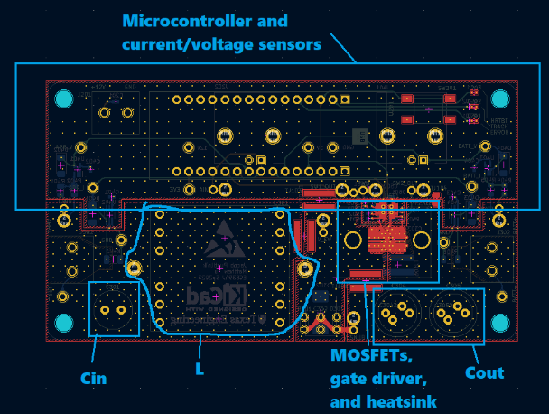
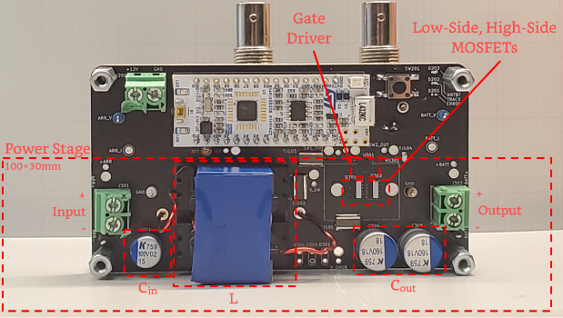

---

### Simulation Results

The following graphs are generated from the automated design system with the
chosen devices provided as parameters.


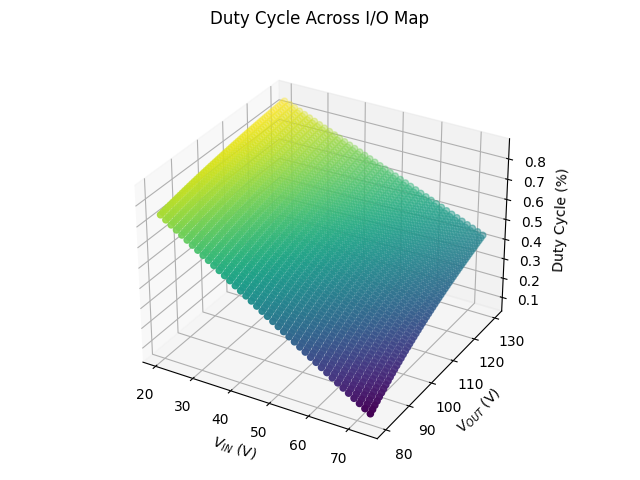

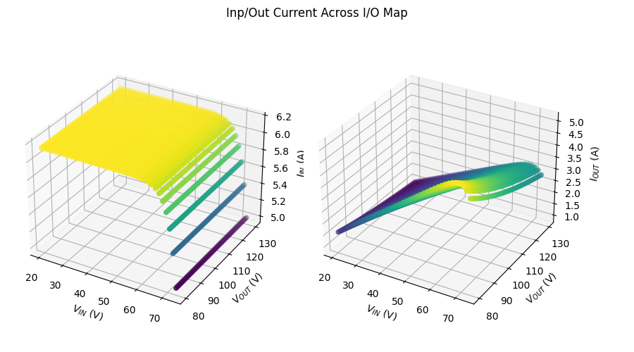

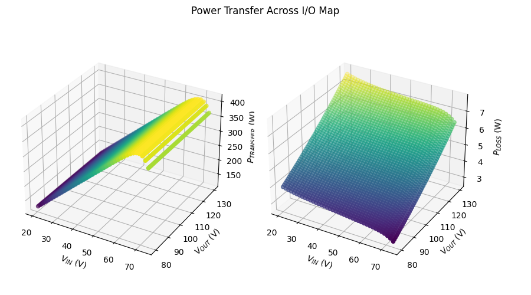

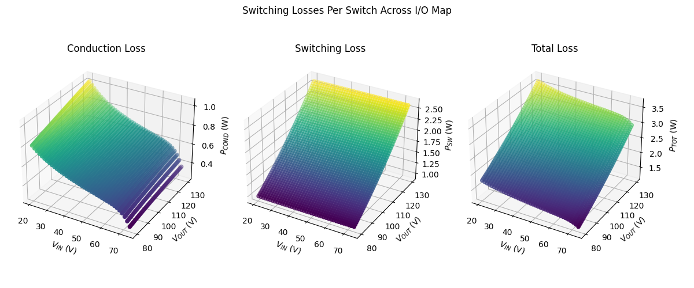


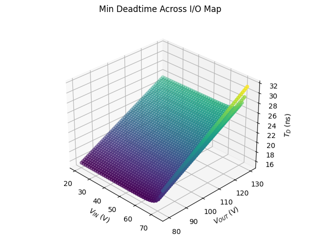

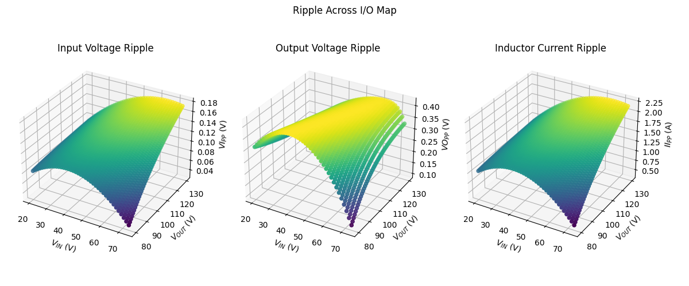

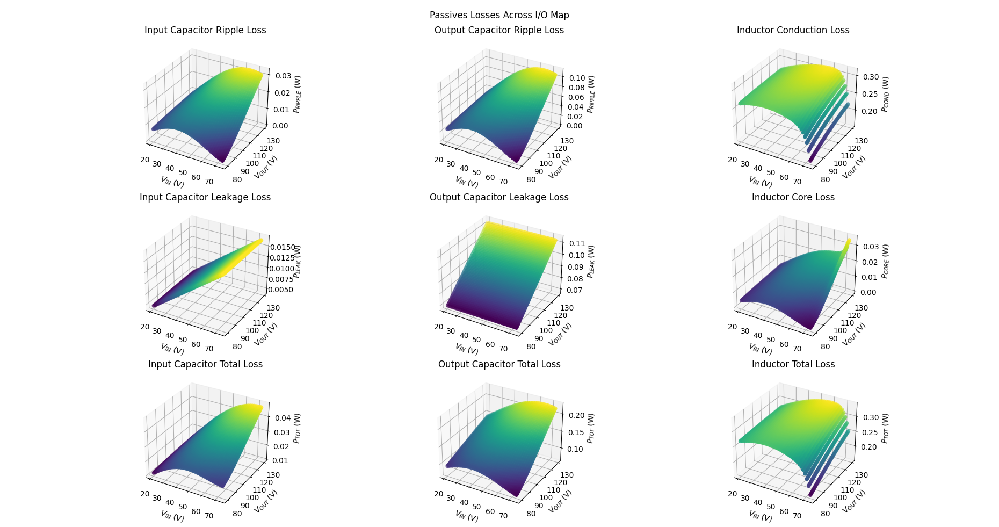

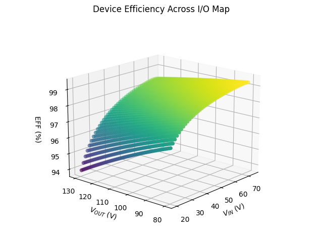

We note that the total power loss derived from the hand-picked design is
$7.63 \, W$, at the highest switching stress operating point: min input voltage,
max output voltage. This results in a minimum transfer efficiency of $93.92 \, \%$.

At this operating point the switch conduction loss and switching loss peaks,
contributing to about $3.60 \, W$ of loss each, with the inductor and output
capacitor providing the majority of the rest (generally through output capacitor
leakage loss and inductor conduction loss).

We also note that minimum required area needed to maintain both switches below
the maximum rated temperature time the 1 / safety factor starting from $60 \, C$ is
$70.893 \, cm^2$. The layout design has a total surface area of $110 \, cm^2$,
which is should be sufficient for cooling without an external heatsink.

---

### Experimental Results

Note for the purposes of the experimental testing, we ran the device at
$100 \, kHz$.

We also used an inductor wound at $155 \, \mu H$, with about 30 turns of AWG 21
wires, and a gap on each side of the core of roughly $0.318 \, mm$.

We obtained the following experimental results:

| Vin (V)           | Vout (V)     | Pout (W)     | Eff (%) | Pdensity (W/cm3) | Vin, p-p (V) | Vout, p-p (V) | Il, p-p (A) |
|-------------------|--------------|--------------|---------|------------------|--------------|---------------|-------------|
|       67.524 (69) | 102.02 (105) | 380.87 (400) |  98.972 |            1.979 |        0.234 |         0.309 |       1.820 |
| Broad range tests |              |              |         |                  |              |               |             |
|            18.752 |       73.242 |       83.154 |  97.349 |            0.432 |        0.226 |         0.365 |       1.159 |
|            18.825 |        96.73 |       84.416 |  97.032 |            0.439 |        0.249 |         0.402 |       1.263 |
|            18.823 |       119.35 |       83.889 |  96.531 |            0.436 |        0.330 |         0.510 |       1.440 |
|            38.805 |       76.688 |       181.72 |  98.616 |            0.944 |        0.270 |         0.356 |       1.520 |
|            38.782 |        100.8 |       182.74 |  98.348 |            0.949 |        0.295 |         0.412 |       1.959 |
|             38.78 |       124.54 |       182.34 |  98.083 |            0.947 |        0.336 |         0.489 |       2.199 |
|            58.798 |       77.774 |        279.2 |  99.103 |            1.450 |        0.249 |         0.348 |       1.280 |
|             58.76 |       102.01 |       281.43 |  98.904 |            1.462 |        0.299 |         0.411 |       2.000 |
|            58.741 |       126.28 |       282.55 |  98.671 |            1.468 |        0.346 |         0.495 |       2.480 |
|            67.592 |       77.744 |       371.13 |  99.146 |            1.928 |        0.149 |         0.278 |       0.840 |
|            67.524 |       102.02 |       380.87 |  98.972 |            1.979 |        0.234 |         0.309 |       1.820 |
|            67.471 |       126.19 |       375.78 |  98.782 |            1.952 |        0.265 |         0.325 |       2.540 |
|            74.612 |       79.447 |       97.746 |  99.071 |            0.508 |        0.217 |         0.428 |       0.580 |
|            74.609 |       104.35 |       98.194 |  98.484 |            0.510 |        0.226 |         0.419 |       1.640 |
|            74.606 |       129.25 |       98.805 |  97.806 |            0.513 |        0.273 |         0.457 |       2.359 |

We note that the switching noise was minimal, indicating that the switching node
layout was optimized well enough to not severely impact the design results.

We measured a worst I/O mapping efficiency ($18.8 \, V$ to $119.3 \, V$) of
$96.5 \, \%$, exceeding our expected lower bound. We measured a best I/O mapping
efficiency ($67.6 \, V$ to $77.7 \, V$) of $99.1 \, \%$, within measurement error
to meet our upper bound.

We do not meet our simulated ripple results, potentially due the following
factors, but still comfortably beat our ripple specifications by up to 50%.

- measurement error (using oscilloscope)
- switching noise
- change in inductor design

We observe that the experimental data power loss map shows deviations from
simulation; if we observe the trend of loss increase across each axis, the
underlying switching and conduction loss agree. In between however, some
datapoints exceed expectations and have larger losses than can be explained by
simulations (although some may be attributable to inductor loss at the input
MPP).

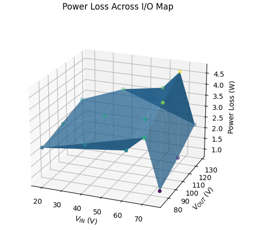


Thermal wise, the losses were expected to be in two main components: the
switches and inductor. According to the thermal images, this shows up as
expected. The maximum recorded temperature of the switch devices was $60 \, C$,
from am ambient of about $20 \, C$, the 40 degree temperature increase is in
line with the anticipated loss at that particular operating point (~$3.6 \, W$).

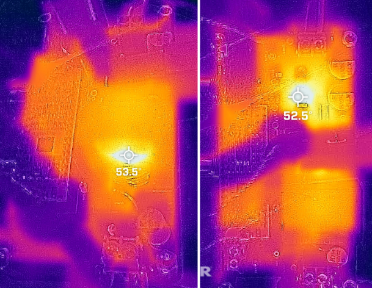

---

## Automated Design


An automated design optimizer algorithm was developed to speed up and improve
the design process outlined by the hand designed procedures.

A design specification file and a list of design components are provided, in
which the optimizer chooses the optimal parts and calculates the operating
parameters that maximizes system efficiency.


The optimizer controls two parameters: the power budget allocated to each switch
and the inductor current ripple ratio. The user maintains constraints, including
the input voltage and output voltage range, or the safety factor of the design.


As outlined in the optimizer algorithm, every design iteration starts with a
selection on the switch power budget and the inductor current ripple ratio. The
algorithm first determines the switch and the switching frequency before
selecting for an optimal set of capacitors and then the inductor configuration.
Finally, the overall worst case power loss is determined before repeating the
loop.

After many iterations, the optimizer settles on the parameters that lead to the
highest efficiency design. The output of these parameters results in the
selection of design components for use.

The automated design was ran on the same specification file and user constraints
as defined in the hand-designed section.

---

### Optimizer Design Output

It was evaluated that the optimal parameter values that led to the ideal design
was an $R_{L}$ of 0.119 and a $P_{SW\_BUD}$ of 2.13 W.

The switches chosen were the EPC2207 (now in stock), which had an optimal
frequency of $95 \, kHz$; this led to the following passive requirements:

- Input capacitance greater than $2.67 \, \mu F$
- Output capacitance greater than $16.16 \, \mu F$
- Inductance greater than $280.51 \, \mu H$.

---

#### Capacitor FOM

A custom FOM was developed for selecting optimal capacitors for the design. We
remind the reader of the parameters defined earlier in the hand-design section
for choosing capacitors:

> - the required capacitance needed to reduce ripple to below the design
>   specification at the worst case operating point,
> - the ripple current that needs to be supported by the set of capacitors,
> - and the loss due to ESR and leakage current.
>
> The first and second parameters are the constraining function of the capacitor
> selection, while the third parameter is the optimization function of the
> capacitor selection.

Ideally, we want to choose as few capacitors as possible to meet the first two
parameters, but also minimize the third parameter. As this is a multi-objective
optimization problem, the brute force method would be to form the power set of
all candidate capacitors, filter the sets that do not meet the constraints, and
choose the smallest and most optimal set.

However, we propose the following FOM equation to speed up the process:

$$
FOM = \frac{V_{D} * C * I_{RIPPLE}}{ESR * I_{LEAKAGE} * COST}
$$

As can be seen, this formula rewards higher constraints while punishing
undesirable aspects that affect power (and cost).


A subset of capacitors with the FOM added is shown. We can see that the best FOM
capacitors tended to have reasonable capacitance, ripple, and cost, but low ESR,
and leakage.

Ultimately this worked well for this design, with the optimizer choosing the
HZA336M080G24T-F $33 \, \mu F$ aluminium electrolytic capacitor for the input
and the A759MS186M2CAAE090 $18 \, \mu F$ aluminum organic polymer electrolytic
capacitor for the output.

---

#### Inductor Optimization

The optimizer selected a slightly different core than the hand-design, a
PQ26/25-3C96 with 53 turns of 21 AWG wire. A core gap of 1.4 mm is suggested.

Inductor selection was performed with extra component listings for the core
shape and material: the material in particular provided constants calculated by
FerroxCube to calculate the core loss with Steinmetz' equation. This meant that
there was no need to manually infer the $P_{V}$ from the manufacturer datasheet
for our particular frequency, core shape, and temperature.

The optimization procedure only optimizes for loss, however; other parameters of
interest, like cost and core size are neglected in favor of the design with the
least conduction and core loss.

---

### Optimizer Simulation Output

The following graphs are generated from the automated design system with the
chosen devices provided as parameters.

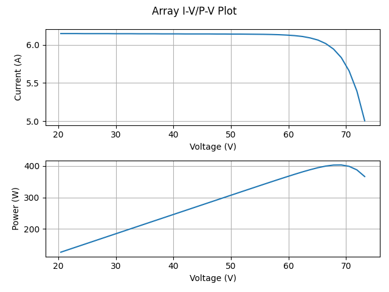


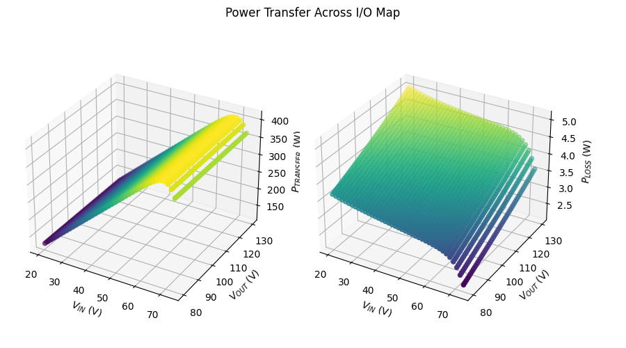

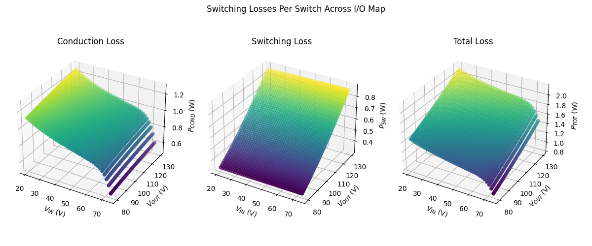

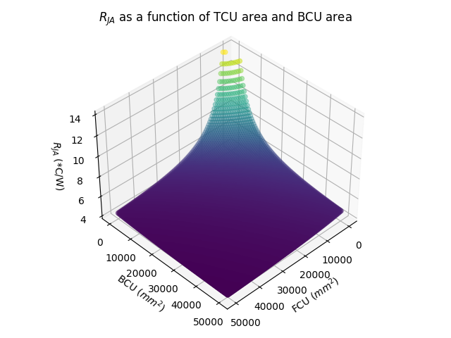

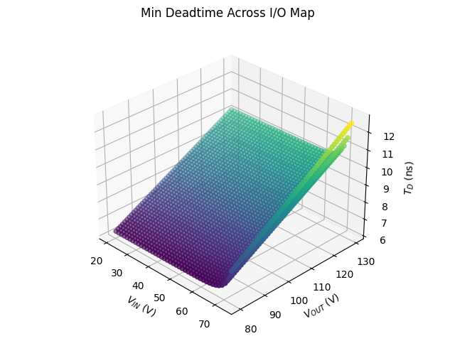

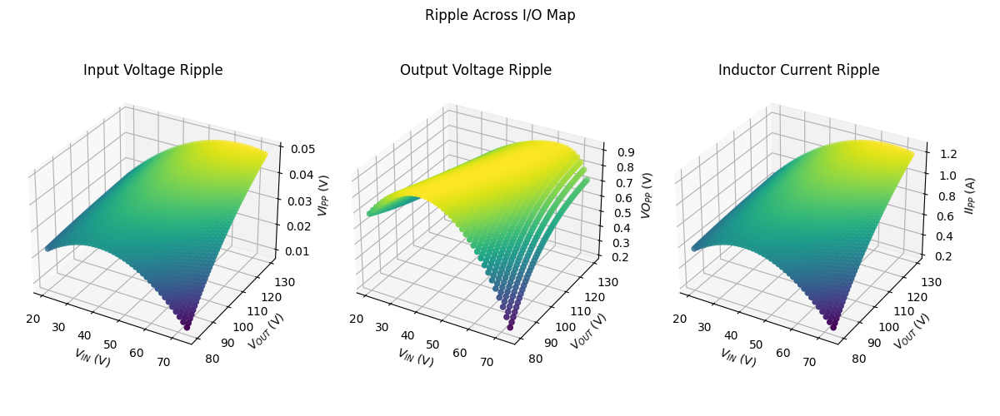

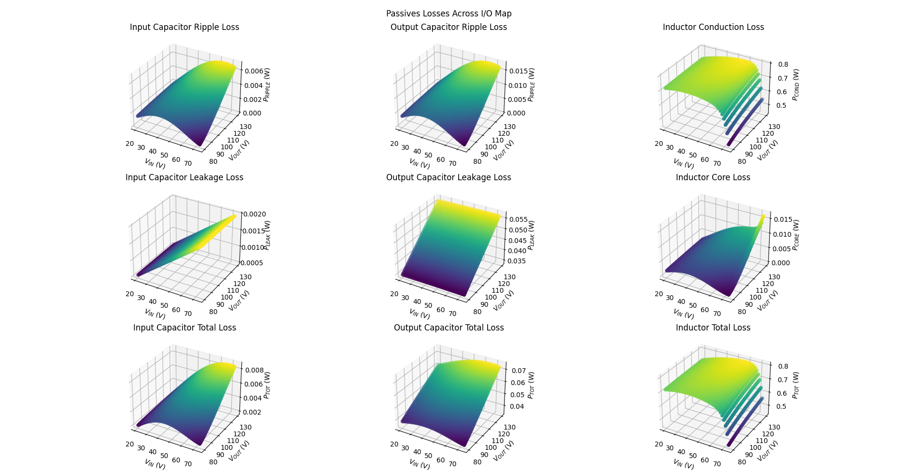

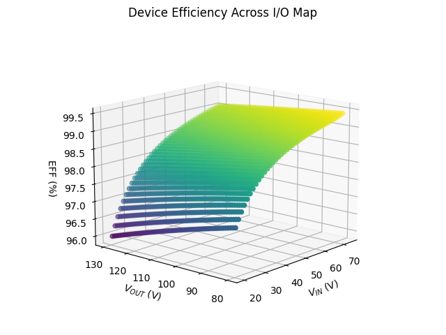

We note that the total power loss derived from the automated design is
$5.04 \, W$, at the highest switching stress operating point: min input voltage,
max output voltage. This results in a minimum transfer efficiency of $96.0 \, \%$.

At this operating point the switch conduction loss and switching loss peaks,
contributing to about $2.12 \, W$ of loss each, with the inductor conduction
loss providing the rest.

We also note that minimum required area needed to maintain both switches below
the maximum rated temperature time the 1 / safety factor starting from $60 \, C$ is
$35.546 \, cm^2$, a 2x improvement. This allows us to shrink the required
exposed thermal area by a significant margin, and should enable us to remove the
existing thermal jumpers.

Also notably improved is the dead time, with the majority of the design only
needing at most $12 ns$ of deadtime.

We see that this automated design beats the reverse engineered hand-designed
version by at least $2 \, \%$. The upper bound efficiency also improves
marginally. At the same time, our expected number of capacitors decreases, our
required thermal area shrinks, and thus we can remove extraneous components like
heat sinks, and thermal jumpers.

Judging by our empirical losses, it would be very positive if we can exceed our
lower bound efficiency estimate again.

---

## Conclusion and Further Work

In conclusion, the overall system design is a good starting point towards
modeling DC-DC converters with only a few known parameters. A hand-designed
system is compared against a fully automated result, and the initial efficiency
results, both simulated and emperical, show high marks. The automated design
appears to improve upon the hand-designed converter by at least $2 \, \%$ in the
worst operating regime, which is promising.

In this report, we do not discuss the open and closed loop stability of the
design. However, we have validated that the system is indeed open and closed
loop stable. Further work in this project will involve the small signal and
large signal stability analysis of the system to characterize the stability of
the system before comparing it against empirical stability.

In addition to this analysis, further effort should be performed to gather higher
resolution steady state efficiency. More experimental data points can help
inform the accuracy of the model and where the design process can be improved.

Further research into choosing an appropriate FOM should be performed.
While the proposed FOM works well for this design, it is likely not optimal in
all cases: a brute force solution should be determined as the golden reference,
and a PCA or curve fitting technique should be performed on the available
capacitor parameters to determine weightings for the values that match the golden
reference.

Finally, work into automating the decision of choosing HF capacitors should be
performed. This is slightly more difficult for MLCCs due to the data-intensive
work of gathering frequency vs impedance CSVs (and so forth) from manufacturers
that provide them, such as KEMET and TDK. However, their data can improve the
optimization process and provide useful insight into stability analysis due to
their effects on the design poles and holes.